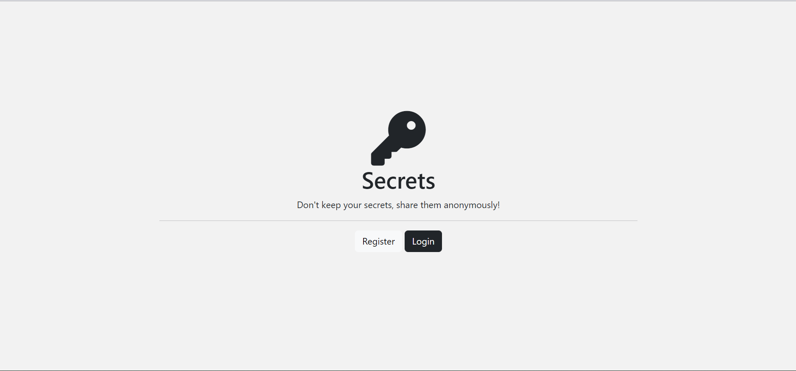
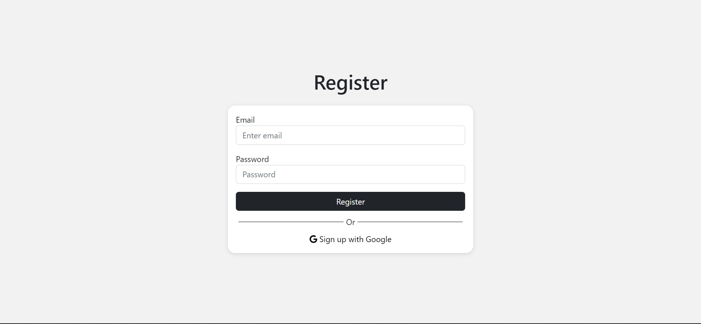
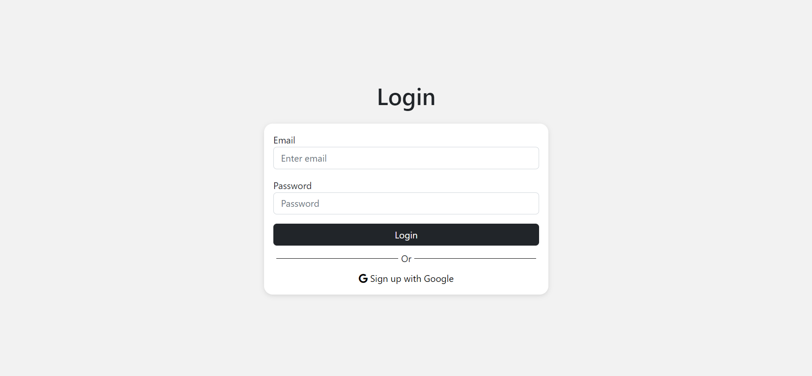
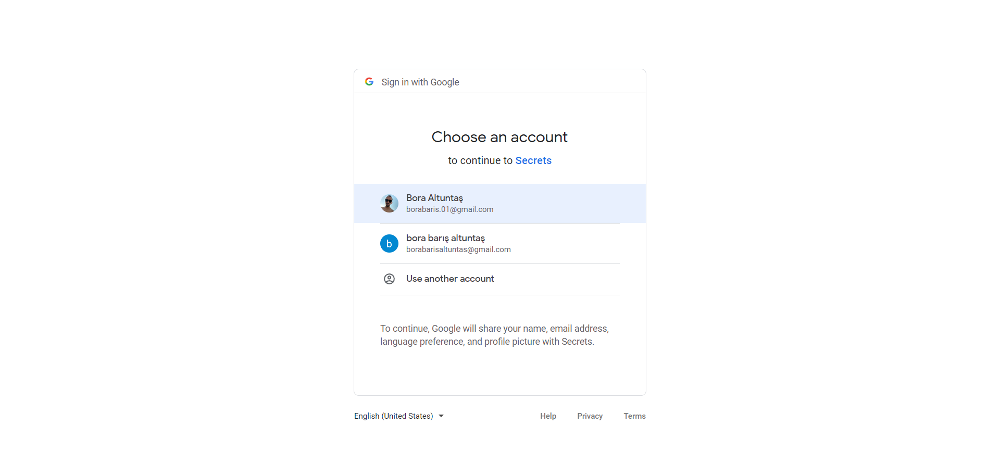
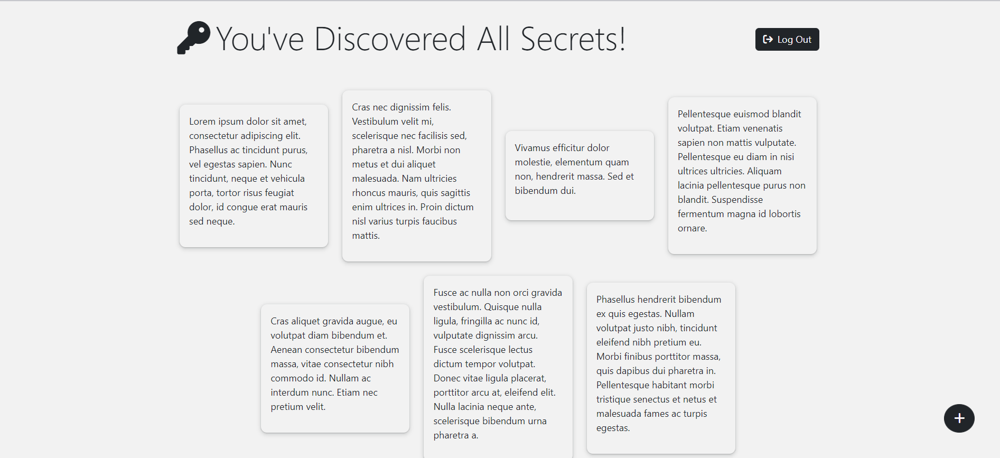
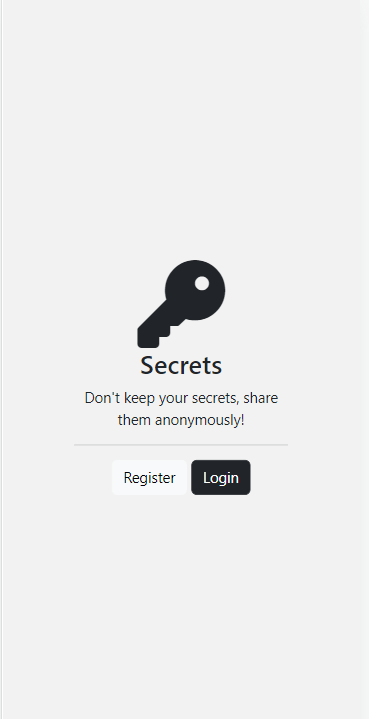
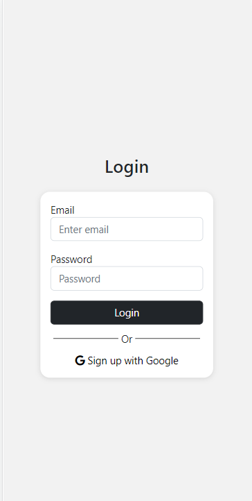
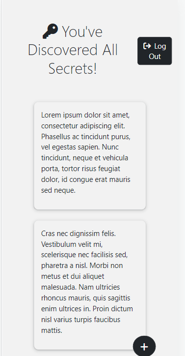
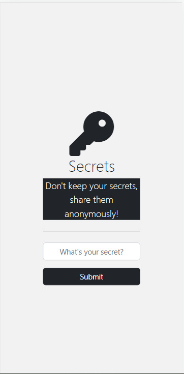

# Authentication-Secrets

Website that everyone can share their secrets anonymously.

## Table of contents

- [Overview](#overview)
    - [The challenge](#the-challenge)
    - [Screenshot](#screenshot)
    - [Links](#links)
- [My process](#my-process)
    - [Built with](#built-with)
- [Author](#author)

## Overview

### The challenge

Users should be able to:

- Create and account either using Google or with our System.
- When they use our register system their password is encrypted bys using hashing and salting algorithms.
- After they logged in, all users can see the secrets of all users without seeing their profile.
- If they want, they can submit their secrets anonymously.

## Screenshot

### Desktop View







### Mobile View

<div style="display:flex; gap: 1em; flex-wrap: wrap">




</div>

### Links

- Solution URL: [Github Repo](https://github.com/bbaltuntas/Authentication-Secrets)

## My process

### Built with

- Semantic HTML5 markup
- CSS custom properties
- Flexbox
- Mobile-first workflow
- [node.js](http://nodejs.org) - for the backend
- [MongoDB](https://www.mongodb.com/) - for Database
- [Express](https://expressjs.com) - node.js network framework
- [EJS](https://ejs.co) - node.js template framework
- [jQuery](https://jquery.com/) - For DOM
- [Bootstrap](https://getbootstrap.com/) - The most popular HTML, CSS, and JavaScript framework
- [Google Fonts](https://fonts.google.com) - Beautiful Fonts
- [Font Awesome](https://fontawesome.com/) - Icons
- [Passport](https://www.passportjs.org/) - Simple, unobtrusive authentication for Node.js
- [Mongoose](https://mongoosejs.com/) - Elegant mongodb object modeling for node.js

```html
<h1>Some HTML code I'm proud of</h1>
```

```css
.proud-of-this-css {
    color: papayawhip;
}
```

```js
const proudOfThisFunc = () => {
    console.log('🎉')
}
```

# Installation

To run the web app on your local computer you need Node.js to run. You have to create your own Google Client ID and
Client Secret. And when initialization session, you should use your own long string.

```
cd todolist-v1
npm i
node app.js
```

## Author

- Github - [Bora Barış Altuntaş](https://github.com/bbaltuntas)
